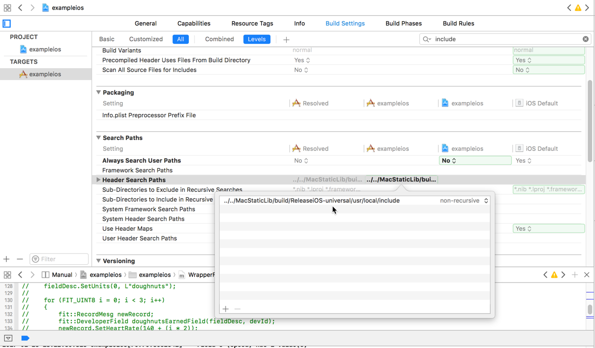
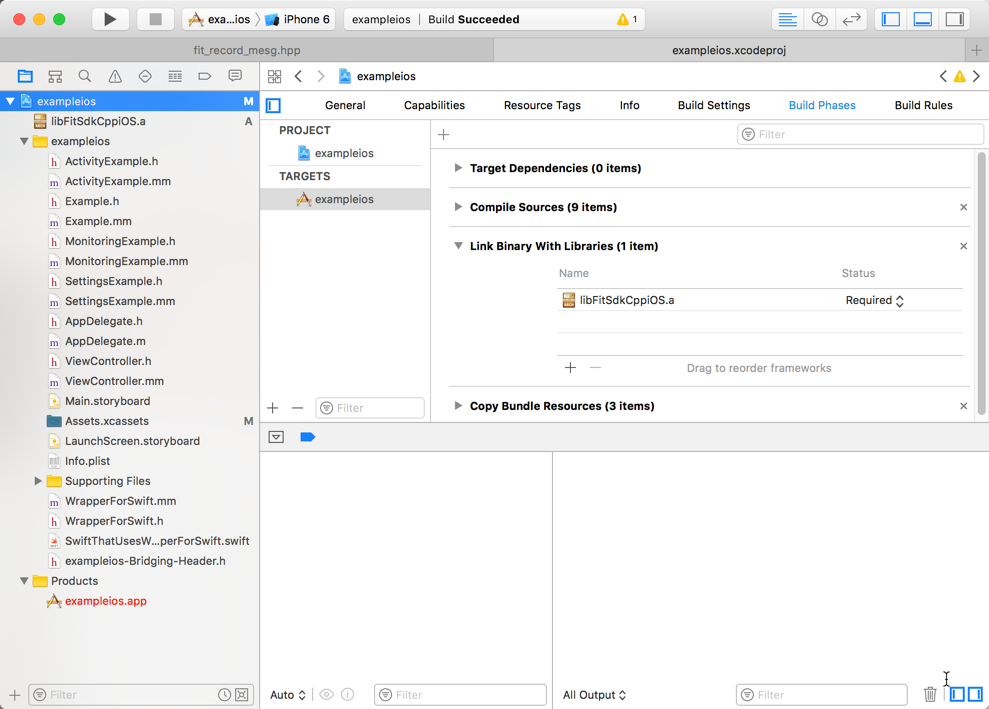
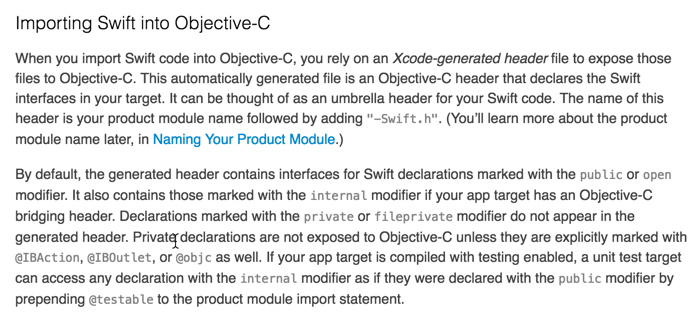
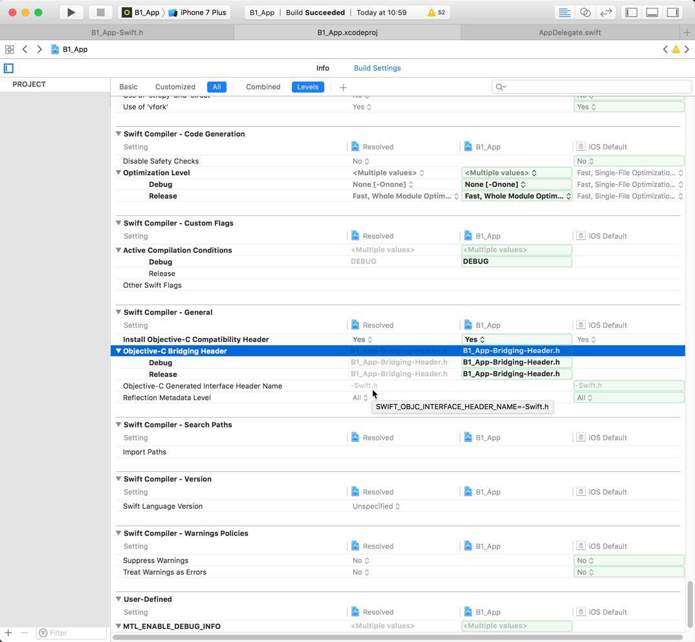

# fit-sdk-with-swift
### Back Story
The [FLEXIBLE AND INTEROPERABLE DATA TRANSFER (FIT) PROTOCOL SDK](https://www.thisisant.com/resources/fit/) is a binary encoded data format used in the world of embedded fitness and activity-related sensors and associated client and service software. It's basically what an activity sensor like a running or cycling computer might use, or a fancy fitness scale or other exercise gear. The format is interoperable, meaning that a plurality of clients or services can use it without knowing anything about the client or service that may have generated the data. At the same time, the SDK embeds information about specific clients or services, such as manufacturer, device serial number and so forth.

The most useful aspect of the SDK is the ability to encode and decode in the FIT binary format. This makes it possible to consume FIT data from devices or services, or generate FIT data from, for example, a device.

The SDK has examples and static libraries for a variety of languages, including C, C++, Objective-C, Objective-C++, C# and jars for Java.

But — I needed it to work with Swift, which was my language of choice for a from-the-ground iOS app. Building naively caused a trainwreck that kept happening with no end in sight. In frustration and like a mad dog after a rabbit, I built my own parser in Swift — after days and days of not getting the thing to build with Swift. But then Will made me realize that that's not really a solution as it's an SDK that evolves and I was just making a maintenance task for myself. On top of everything else. So, basically – I had to get it to work..

### So..now what?
Most resources explain that interoperability is possible between Swift and C, C++, Objective-C and Objective-C++ (cf: [How To Call Objective-C Code From Swift](http://stackoverflow.com/questions/24002369/how-to-call-objective-c-code-from-swift) and [Can I Have Swift Obj-C and C Files In The Same XCode Project](http://stackoverflow.com/questions/32541268/can-i-have-swift-objective-c-c-and-c-files-in-the-same-xcode-project/32546879#32546879), but I had a bit of a struggle trying to figure out how to get the static library for this SDK to build such that Swift source could call methods in the SDK (cf: [Building Swift and Objective-C and a Static C++ Library Together](http://stackoverflow.com/questions/42383838/building-swift-objective-c-and-a-static-c-library-together)). I mostly ended up with a plaintive linker error complaining that some class in the standard c++ library (`libstdc++`) like `<string>` or `<vector>` or `<map>` couldn't be found. Which isn't the best clue. Ultimately, after puzzling this through with some folks who were very generous with their time, I came to the conclusion that, actually, the linker error is indicating that the C++ from those libraries were just completely alien to Swift. In fact, those classes from the standard library that were breaking things have their own native forms in Foundation — String, Array and Dictionary.

Getting the [FIT SDK](https://www.thisisant.com/resources/fit/) to work with Swift was a bit of a bear. There's currently no native Swift code in the SDK, so the project became finding out how Swift can interoperate so that I can call API methods in the SDK from Swift source.

This repository has a rudimentary example of getting Swift to play with the C++ SDK.

### Configuration
You will need the FIT SDK itself to build this project, particularly the headers found under the FIT SDK Root, i.e.

`FitSDKRelease_20.xx.01/cpp/MacStaticLib/build/ReleaseiOS-universal/usr/local/include`

In Xcode, under Target Build Settings, you'll want to make sure that your Header Search Path is set to point to the necessary headers found in the above directory.



You’ll also need the static library that comes with the FIT SDK, and the appropriate one for your platform. (E.g. on iOS you’ll use the one called `libFitSdkCppiOS.a`) You should be able to drag it into the Project Navigator and Xcode should ask you if you want to include it. You can double-check that it’ll be used by the linker in `Targets/Build Phases/Link Binary With Libraries`



Also notice the bridging header — `exampleios-Bridging-Header.h`. Sometimes XCode would prompt me to make it — and sometimes it wouldn't. No particular rhyme or reason that I could discern just, like..XCode. But, the name is automatically generated by XCode, and you can create the file yourself. It's all described in an Apple document called [Importing Swift into Objective-C](https://developer.apple.com/library/content/documentation/Swift/Conceptual/BuildingCocoaApps/MixandMatch.html#//apple_ref/doc/uid/TP40014216-CH10-ID122) in the section Importing Swift into Objective-C. This section describes the somewhat cloaked minutae of this particularly named bridging header.



For this particular configuration, my bridging header is named `exampleios-Bridging-Header.h` and it looks like all of this:


```Objective-C
#import "WrapperForSwift.h"
```

That's it. It just exposes my Objective-C wrapper class called WrapperForSwift which itself, for this simple test case, simply has one method exposed, called `decode` which, like..does that..does what it needs to do to "decode" a sample FIT file. That class' header (`WrapperForSwift.h`) looks like this:

```Objective-C
#import <Foundation/Foundation.h>


@interface WrapperForSwift : NSObject
    - (UInt8)decode;
@end
```

And the implementation, called `WrapperForSwift.mm` has all the methods that call aspects of the SDK's API as needed to perform a decode operation on a FIT file. (Where I had been having trouble was not having this "wrapper" idiom tidied up. I'm not sure exactly where I went wrong except to say that the build tools were expecting to compile C++ from an Objective-C class and ran into a brick wall when it hit all the includes in the SDK's code, including things like `#import <vector>` and the like.)

There's some business in there hard-coded (the path to the file) but this is just a test to see if I can get the dang thing to take. This particular class was basically copied and modified from the existing `ActivityExample.mm` file that is part of the SDK. Note the naming — `.mm` — which is the Objective-C++ file naming extension. The class also contains a Objective-C++ class (I think what in the Java world would be an inner-class?) called ActivityListener that adheres to a protocol by which the decoder can make callbacks to this listener when it decodes specific message types within the FIT file. Which is useful.

(My mistake or misunderstanding had been that I didn't expose just the wrapper, but also bits of the SDK's API — header files sometimes, and then I'd try something else, but never just a clean include of only the wrapper. I had also not been doing the wrapper properly — so eventually the linker was expecting that it needed to link Swift to C++ libraries of alien things like <string>, whereas I believe Swift and the like expect NSString or just plain old String from Foundation.)

So — that's all the configuration and setup. Now, to the Swift file itself. I created a test class called `SwiftThatUsesWrapperForSwift.swift` It needs to see the wrapper class, described above, and evidently it is able to with that mention of the Objective-C class to be exposed in that slightly magically instantiated bridging header. You can see that I also had the `@objc` keyword in front of the class. That's if I want to go the other way — have Objective-C call a Swift method. Haven't done that, but that aspect could be useful, particularly in the context of callbacks that may happen during the decoding process and the like. What I have not done yet is return results and so forth. I'm assuming that'll all be fine. (But I also assumed that figuring out how to call methods in the SDK would take 12-17 minutes of my time.)

The only code I added in this particular SDK project was to create `WrapperForSwift.mm`, `WrapperForSwift.h`, the `exampleios-Bridging-Header.h`, and `SwiftThatUsesWrapperForSwift.swift`

### Some additional notes
The mysterious generated header that Xcode creates (named `PROJECT_NAME-Swift.h`) won't have any `#import` for stuff it may need. For example, the generated header made when I followed this procedure whilst including the FIT SDK in a project that was using `UIKit` had references to `CGFloat` and thus generated compiler errors as there as no `#import <UIKit/UIKit.h>` in the generated header. Adding that import before the import of the generated header clears that error.

Also, this is where you'll find the Build Settings referring to the Bridging Header and the Swift Objective-C Interface Header.


That's the summary. Thanks to [Xavier Schott](http://swiftarchitect.com/), Will Carter over at Burner, and Evan Doiron at Dynastream.

Useful Links I Gathered During This:

[Can I have Swift, Objective-C, C and C++ files in the same Xcode project? - Stack Overflow](http://stackoverflow.com/questions/32541268/can-i-have-swift-objective-c-c-and-c-files-in-the-same-xcode-project/32546879#32546879)

[Building Swift, Objective-C and a Static C++ Library Together - Stack Overflow](http://stackoverflow.com/questions/42383838/building-swift-objective-c-and-a-static-c-library-together)

[How to call Objective-C code from Swift - Stack Overflow](http://stackoverflow.com/questions/24002369/how-to-call-objective-c-code-from-swift)

[Getting Started Using C Libraries from Swift](https://spin.atomicobject.com/2015/02/23/c-libraries-swift/)

[HOWTO: Use a C++ Library from Swift](http://www.swiftprogrammer.info/swift_call_cpp.html)

[Problems with FIT SDK in an Xcode Swift Project](https://www.thisisant.com/forum/viewthread/6697/)

[Swift and Objective-C in the Same Project](https://developer.apple.com/library/content/documentation/Swift/Conceptual/BuildingCocoaApps/MixandMatch.html#//apple_ref/doc/uid/TP40014216-CH10-ID122)

[How do I build an iOS Framwork with the FIT C Library?](https://stackoverflow.com/questions/50733326/how-do-i-build-an-ios-framework-with-the-fit-c-library/50754748)
